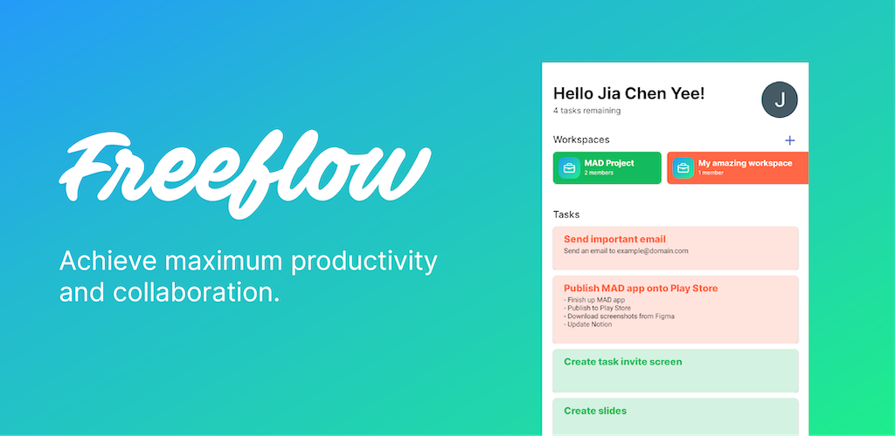

# Freeflow

<!-- ABOUT THE PROJECT -->
<h2> About Freeflow</h2>

For this MAD Assignment, my team decided to create a productivity app, named Freeflow. ✌️
Freeflow aims to achieve maximum productivity and collaboration among users anytime and anywhere. 
Whether users are doing an assignment with your peers or if you're working with external organisations,
you can do it all on Freeflow. 

🤩 Work more efficiently by: 
* Dividing tasks into different workspaces to accomodate to the nature of the projects. 
* Adding mulitple tasks within the workspace to achieve your goal.
* Sorting tasks into categories for easier search and better productivity.
* Adding collaborators into workspaces to work together on projects.

😎 Why Freeflow:
* Handy productivity tool for everyone, no matter if you’re a busy student or a teacher with packed schedules!
* Users can automate routine yet necessary tasks such as project organisation and task deadline reminders.
* Helps users get objectives done with greater efficiency and less hassle.
* Takes stress off user’s minds when tracking tasks and important goals due for each project. 

(<a href="#top">back to top</a>)

### 🛠 Built With
* [Android Studio](https://developer.android.com/studio)
* [Figma](https://www.figma.com/)
* [Firebase](https://firebase.google.com)
  * Firebase Authentication
  * Cloud Firestore
  * Firebase Storage

Other references about the app: 
--> insert flowchart

(<a href="#top">back to top</a>)

## 📲 Installation
### From the Play Store

### Compiling from Source
1. Clone this repository
2. Create a new Firebase project 
    1. Set up Firebase Google authentication,
    2. Set up Cloud Firestore.
    > Minimally, the database rules should allow any signed in user to read and write
    3. Set up Firebase Storage,
    > Minimally, the database rules should allow everyone to read and any signed in user to read and write.
3. Register the app in Firebase and download the `google-services.json` file.
4. Add the google-services.json file into the project in `Freeflow/app`.
5. Generate a `SHA-1` or `SHA-256` fingerprint and add it to the Firebase project settings (in the Firebase console)
6. Run the app!

(<a href="#top">back to top</a>)

  
<!-- USAGE EXAMPLES -->
## Usage

  1. Sign in using your google account
  
     If you are a first time user of the app, you can just sign in using any google account available and the same particulars used during this process will be retrieved 
  during your next usage, saving the need to log in or sign up again (unless user is log out)
     > add screenshot
  
  
  2. Sign out from your account
  
     Click on the google profile picture found on the top right of the main page. Click on sign out from account after redirection to the account page. 
     > add screenshot
  
  
  3. Create a new `Workspace`
  
     Input the `Workspace` name, choose the accent colour (color using throughout this `Workspace`) and insert an image to represent the `Workspace`. If no image is added, the 
  default image will be used.
     > add screenshot
  
  4. Create new `Task` and add to the `Workspace`
  
     Enter new Task name, Task description.....
     > add screenshot

  5. View `Workspaces` and Overdue `Tasks`
  
     hi
     > add screenshot
  
  6. Join `Workspace` through a link
  
     Create a invite link/code by clicking on the Invite `Workspace` settings and copy the link/code to your group members. They will be able to join the Workspace 
  by entering the link/code into the Join `Workspace` settings. 
     > add screenshot
  
  7. Create new `Category`
  
     To group your tasks, create a new `Category` by entering the name of the `Category`.
     > add screenshot
  
  8. View your `Task`
  
     Hi
     > add screenshot
  
  9. Error State
     
     Hi
     > add screenshot
  

(<a href="#top">back to top</a>)

<!-- CONTRIBUTING -->
## Contributions
  
This app was done up by the following students:

* Yee Jia Chen - S10219344C
    * Figma 
        * Design Home Activity
        * Design Workspace Activity
        * Design Task Activity
        * Design Workspace Settings Activity
        * Design Invite Members Activity
        * Design empty state icons
    * Android
        * Connect interface to Database
        * Implement account management activities (Login, User Profile)
        * Implement Create Workspace and Join Workspace
        * Implement tasks creation and deletion
    * Firebase
        * Authentication setup
        * Storage setup
        * Database setup
    * Google Play Store
        * Submission to Google Play Store
  
* Tan Jin Daat - S102
    * Figma 
        * Design New Task Interface
        * Design New Workspace Interface
    * Android
        * Implement Selector Fragment
        * Implement Workspace Activity
    * Google Play Store
        * Design screenshot assets
  
* Yong Zong Han Ryan - S10219317A
    * Figma 
        * Design Screenshot Images
        * Design Login Interface 
    * Android
        * Implement Task Preview Fragment 
        * Implement Workspace Settings Activity (XML)
        * Implement Login Interface Layout
        * Implement New Cateogry Activity 
    * Google Play Store
        * Design app feature graphic
  
* Isabelle - S102
    * Figma 
        * Design Home Empty State 
    * Android
        * Implement Task Header Fragment 
        * Implement New Category Activity
        * Implement Join Workspace Activity 
        * Implement Workspace Invite Activity
    * Google Play Store
        * Write app descriptions
    
* Koh En Yang - S012
    * Figma 
        * Design Home Empty State 
        * Design Join Workspace Interface
        * Create New Workspace Interface
    * Android
        * Implement Task Fragment Activity
        * Implement Error State Fragment
  
- other possible things to add
  * design on figma

(<a href="#top">back to top</a>)

  
<!-- CONTACT -->
## Contact

Your Name - [@your_twitter](https://twitter.com/your_username) - email@example.com

Project Link: [https://github.com/your_username/repo_name](https://github.com/your_username/repo_name)

(<a href="#top">back to top</a>)

<!-- ACKNOWLEDGMENTS -->
## Acknowledgments

Resources which have assisted us throughout the project from creation to publication of the app: 

### Tools
* Design: [Figma](https://figma.com)
* IDE: [Android Studio](https://developer.android.com/studio/)
* Project Management: [Notion](https://notion.so)
  
### Resources  
#### Design Resources and References
* [Material Design](https://material.io/)
* [Apple's Human Interface Guidelines](https://developer.apple.com/design/human-interface-guidelines/)
* [Dribbble](https://dribbble.com/)
* [Mermaid.js](http://mermaid-js.github.io)

#### Code Resources and References
* [Firebase Documentation](http://firebase.google.com/docs/firestore/manage-data/add-data)
* [Geeks for Geeks](https://www.geeksforgeeks.org/)
* [Android Developer Documentation](https://developer.android.com/)
* [Firebase Android Snippets](https://github.com/firebase/snippets-android)
  
### Assets
* Google Play and the Google Play logo are trademarks of Google LLC.
* [Inter - Google Fonts](https://fonts.google.com/specimen/Inter)
* [Material Symbols](https://fonts.google.com/icons)
  

(<a href="#top">back to top</a>)

#### Thanks for reading! 😉
