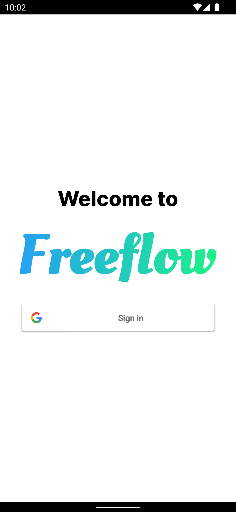
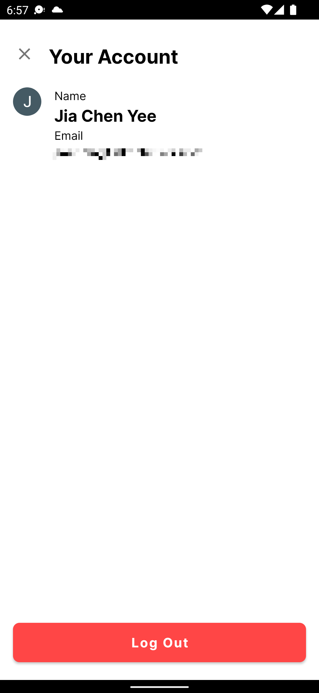
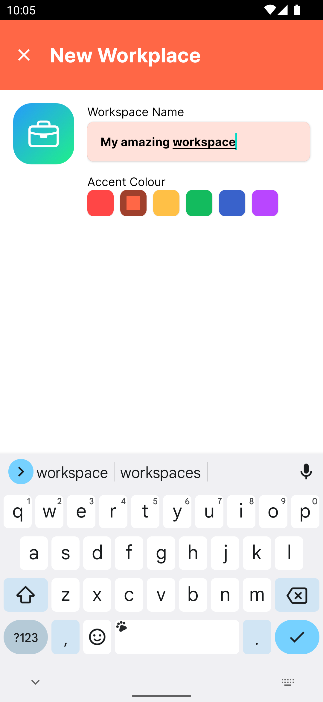
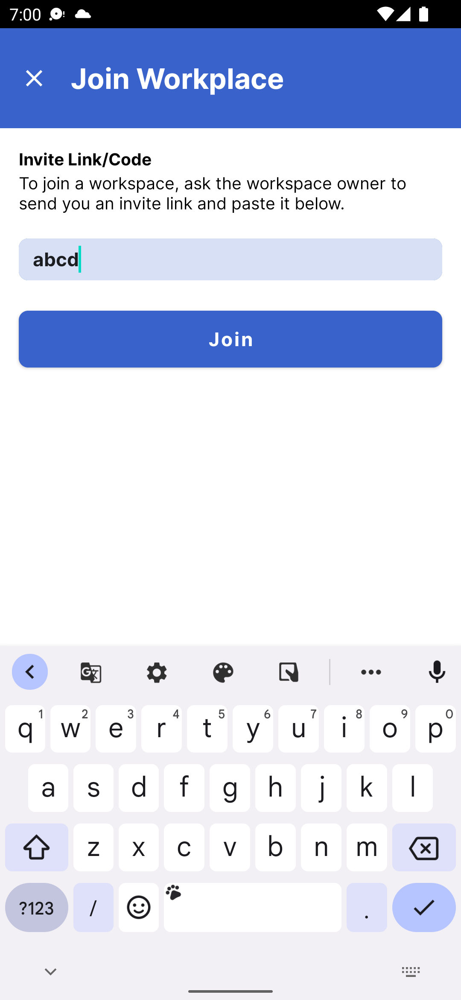
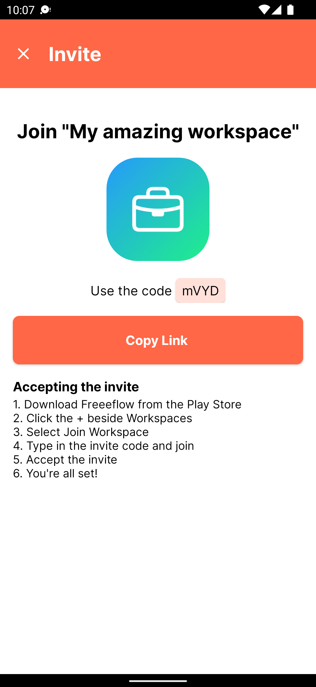
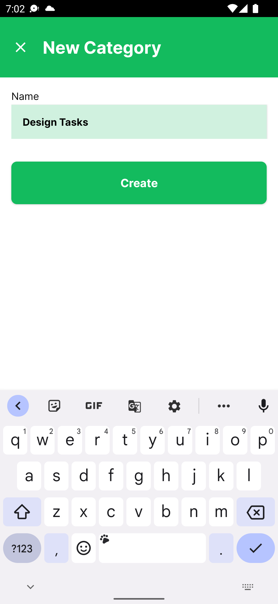
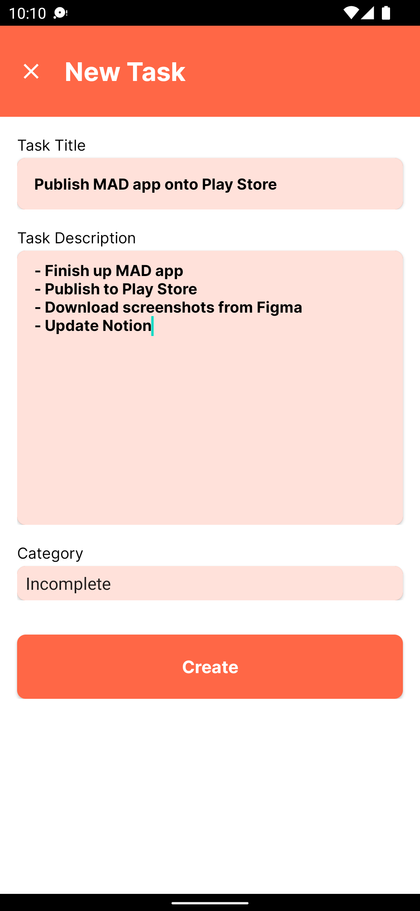
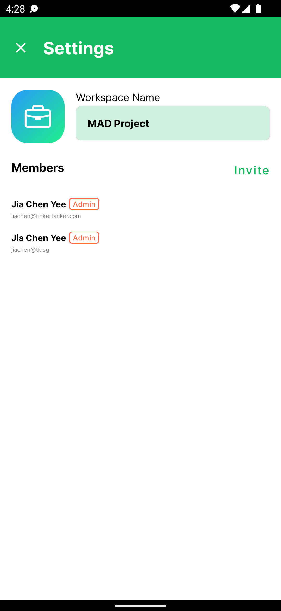
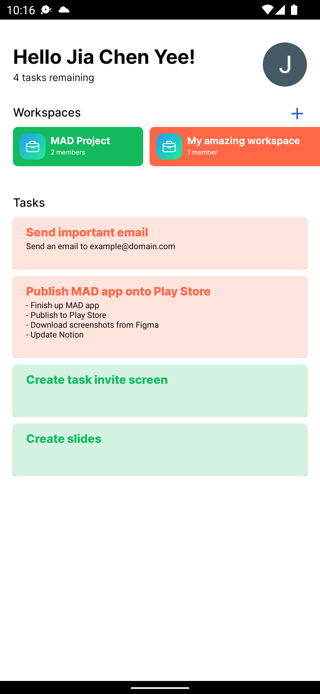
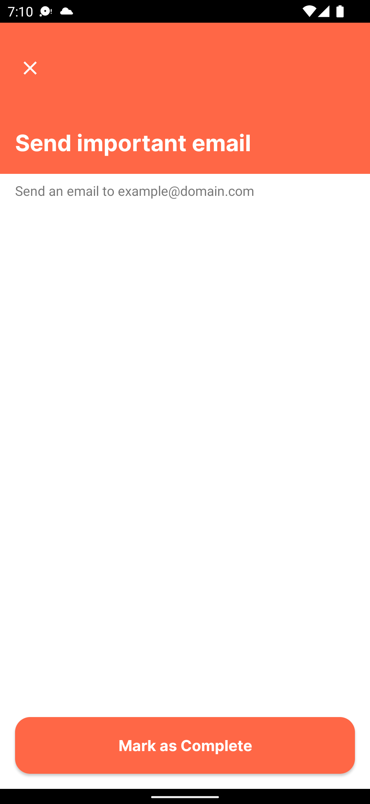

# Freeflow

<!-- ABOUT THE PROJECT -->
<h2> About Freeflow</h2>

For this MAD Assignment, our team decided to create a productivity app, named Freeflow✌️
Freeflow aims to achieve maximum productivity and collaboration among users anytime, anywhere. 
Whether users are doing an assignment with their peers or if they're working with external organisations,
they can do it all on Freeflow. 

🤩 Work more efficiently by: 
* Dividing tasks into different workspaces to accomodate to the nature of the projects. 
* Adding mulitple tasks within the workspace to achieve your goal.
* Sorting tasks into categories for easier search and better productivity.
* Adding collaborators into workspaces to work together on projects.

😎 Why Freeflow:
* Handy productivity tool for everyone, no matter if you’re a busy student or a teacher with packed schedules!
* Users can automate routine yet necessary tasks such as project organisation and task deadline reminders.
* Helps users get objectives done with greater efficiency and less hassle.
* Takes stress off user’s minds when tracking tasks and important goals due for each project. 

(<a href="#top">back to top</a>)

### 🛠 Built With
* [Android Studio](https://developer.android.com/studio)
* [Figma](https://www.figma.com/)
* [Firebase](https://firebase.google.com)
  * Firebase Authentication
  * Cloud Firestore
  * Firebase Storage

Figma Design:
https://www.figma.com/file/Z0WaF42tzMcwXGviUsRSH3/MAD-App?node-id=101%3A2

Other references about the app: 
--> https://github.com/jiachenyee/Freeflow/blob/19527ad548c608d4ca78a2ca3ec22f4013e86158/docs/Database.md

(<a href="#top">back to top</a>)

## 📲 Installation
### From the Play Store

### Compiling from Source
1. Clone this repository
2. Create a new Firebase project 
    1. Set up Firebase Google authentication,
    2. Set up Cloud Firestore.
    > Minimally, the database rules should allow any signed in user to read and write
    3. Set up Firebase Storage,
    > Minimally, the database rules should allow everyone to read and any signed in user to read and write.
3. Register the app in Firebase and download the `google-services.json` file.
4. Add the google-services.json file into the project in `Freeflow/app`.
5. Generate a `SHA-1` or `SHA-256` fingerprint and add it to the Firebase project settings (in the Firebase console)
6. Run the app!

(<a href="#top">back to top</a>)

  
<!-- USAGE EXAMPLES -->
## Usage

1. Sign in using your google account

   If you are a first time user of the app, you can just sign in using any google account available and the same particulars used during this process will be retrieved during your next usage, saving the need to log in or sign up again (unless user is log out).
     
   
  
2. Sign out from your account
  
   Click on the profile picture found on the top right corner of the main page. Click the "Log Out" button once redirected to the account page. 

   
  
  
3. Create a new `Workspace`
  
   Start by clicking the "+" icon at the home page and select "New Workspace", you will then be redirected to "New Workspace" page. Input the `Workspace` name, choose the accent colour (color using throughout this `Workspace`) and insert an image to represent the `Workspace`. If no image is added, the 
  default image will be used.
  
   
     
4. Join a `Workspace` 
  
   Start by clicking the "+" icon at the home page and select "Join Workspace", you will then be redirected to "Join Workspace" page. Here you insert the code of the `Workspace` shared and click "Join".

   
     
5. Invite collaborators to your `Workspace`
  
   Start by selecting the `Workspace` you wish to share, then navigate to the `Workspace` settings by clicking on the gear icon located at the top right hand corner of the selected `Workspace`. Under the `Workspace` settings, click "Invite". A code of the `Workspace` will be shown. Share this code with your intended collaborators or click "Copy Link" to copy the `Workspace` code.
   
   

 6. Create new `Category`
  
    In the selected `Workspace`, click the "+" icon and select "New Category", you will then be redirected to the "New Category". Here you enter the name of the `Category` and click "Create". 
     
    
  
7. Create a new `Task` in a `Workspace`
  
   Start by selecting the `Workspace` you wish to create a new `Task` in. Click the "+" icon and select "New Task", you will then be redirected to "New Task" page. Here you fill in the `Task` name, description and select the category you want the `Task` to be placed in. Once done, click "Create".

   

8. View all `Members` of a `Workspace`
  
   You can view all `Members` of a `Workspace` by navigating to the `Workspace` settings.

   

9. View all `Workspaces` and `Tasks`
  
   You can view all your `Workspaces` and `Tasks` when you open the app. All `Workspaces` are under "Workspaces" and all `Tasks` are under "Tasks".

     
   
9. View details of your `Task`
     
   Details of your `Task` can be seen either by selecting a `Task` from the home page of the app, or selecting a `Task` from a workspace. The name and description of the `Task` will be shown. From here, you can tap on `Mark as Complete` to mark the task as complete and remove it.
   
   
    

(<a href="#top">back to top</a>)

<!-- CONTRIBUTING -->
## Contributions
  
This app was done up by the following students:

* Yee Jia Chen - S10219344C
    * Figma 
        * Design Home Activity
        * Design Workspace Activity
        * Design Task Activity
        * Design Workspace Settings Activity
        * Design Invite Members Activity
        * Design empty state icons
    * Android
        * Connect interface to Database
        * Implement account management activities (Login, User Profile)
        * Implement Create Workspace and Join Workspace
        * Implement tasks creation and deletion
    * Firebase
        * Authentication setup
        * Storage setup
        * Database setup
    * Google Play Store
        * Submission to Google Play Store
  
* Tan Jin Daat - S10222867E
    * Figma 
        * Design New Task Interface
        * Design New Workspace Interface
    * Android
        * Implement Selector Fragment
        * Implement Workspace Activity
    * Google Play Store
        * Design screenshot assets
  
* Yong Zong Han Ryan - S10219317A
    * Figma 
        * Design Screenshot Images
        * Design Login Interface 
    * Android
        * Implement Task Preview Fragment 
        * Implement Workspace Settings Activity (XML)
        * Implement Login Interface Layout
        * Implement New Category Activity 
    * Google Play Store
        * Design app feature graphics
  
* Isabelle - S10222456J
    * Figma 
        * Design Home Empty State 
    * Android
        * Implement Task Header Fragment 
        * Implement New Category Activity
        * Implement Join Workspace Activity 
        * Implement Workspace Invite Activity
    * Google Play Store
        * Write app description
    
* Koh En Yang - S10222282K
    * Figma 
        * Design Home Empty State 
        * Design Join Workspace Interface
        * Create New Workspace Interface
    * Android
        * Implement Task Fragment Activity
        * Implement Error State Fragment
  

(<a href="#top">back to top</a>)

  
<!-- CONTACT -->
## Contact

Yee Jia Chen - s10219344@connect.np.edu.sg

Tan Jin Daat - s10222867@connect.np.edu.sg

Yong Zong Han Ryan - s10219317@connect.np.edu.sg

Isabelle Pak Yi Shan - s10222456@connect.np.edu.sg

Koh En Yang - s10222282@connect.np.edu.sg

(<a href="#top">back to top</a>)

<!-- ACKNOWLEDGMENTS -->
## Acknowledgments

Resources which have assisted us throughout the project from creation to publication of the app: 

### Tools
* Design: [Figma](https://figma.com)
* IDE: [Android Studio](https://developer.android.com/studio/)
* Project Management: [Notion](https://notion.so)
  
### Resources  
#### Design Resources and References
* [Material Design](https://material.io/)
* [Apple's Human Interface Guidelines](https://developer.apple.com/design/human-interface-guidelines/)
* [Dribbble](https://dribbble.com/)
* [Mermaid.js](http://mermaid-js.github.io)

#### Code Resources and References
* [Firebase Documentation](http://firebase.google.com/docs/firestore/manage-data/add-data)
* [Geeks for Geeks](https://www.geeksforgeeks.org/)
* [Android Developer Documentation](https://developer.android.com/)
* [Firebase Android Snippets](https://github.com/firebase/snippets-android)
  
### Assets
* Google Play and the Google Play logo are trademarks of Google LLC.
* [Inter - Google Fonts](https://fonts.google.com/specimen/Inter)
* [Material Symbols](https://fonts.google.com/icons)
  

(<a href="#top">back to top</a>)

#### Thanks for reading! 😉
