# Creating a Workspace
The workspace creation algorithm should:
- Get input from user on accent color, icon, name
- Compresss workspace icon and convert to JPEG for storage
- Upload workspace icon to Cloud Firestore
- Create Firebase Dynamic Link to use as an invite link
- Handle a case when a user does not submit a workspace icon and use a default icon
- Present a toast to the user should any error occur

```mermaid
flowchart
  start([START]) --> A[/INPUT workspaceName/]
  A --> B[/INPUT accentColor/]
  B --> C[/INPUT workspaceIcon/]
  
  C --> D[Async: Compress workspaceIcon and convert to JPEG]
  D --> E[Async: Upload workspaceIcon to Firebase Storage]
  
  E --> AA{Is the upload task successful?}
  AA -- Yes --> F[Set workspaceIconURI to Firebase Storage link]
  AA -- No --> X
  
  C --> G[Async: Get a unique workspaceInviteURI from Firebase Dynamic Links]
  G --> AB{Is the dynamic link creation successful?}
  AB -- Yes --> O[Set workspaceInviteCode to the last path component of workspaceInviteURI]
  AB -- No --> X
  
  F --> H{Is workspaceInviteURI not null, and workspaceIconURL not null or workspaceIcon null?}
  O --> H
  
  H -- Yes --> I[/INPUT userID/]
  I --> J[/Create new Map<String, Object>, workspace/]
  J --> K[Set workspace accentColor to accentColor]
  K --> L[Set workspace inviteCode to workspaceInviteCode]
  L --> M[Set workspace name to workspaceName]
  M --> N[Set workspace accentColor to accentColor]
  N --> P{Is workspaceIconURL null?}
  P -- Yes --> Q[Set workspace workspaceIconURL to workspaceIconURL]
  P -- No --> R[Create a new list, users, containing userID]
  Q --> R
  R --> S[Set workspace admin to users]
  S --> T[Set workspace users to users]
  
  T --> U["Write to Cloud Firestore at workspaces/"]
  U --> V{Is the database write successful?}
  
  V -- Yes --> W["Create userReference to get user document from Cloud Firestore using users/userID"]
  W --> AC[Set workspaceID to the auto-generated ID from Firestore]
  AC --> AD["Async: Append workspaceID to users/userID workspaces property in Cloud Firestore"]
  
  V -- No --> X[Present error toast to user]
  
  AD --> Y{Is the database write successful?}
  
  Y -- Yes --> Z[Reload workspace list data]
  Y -- No --> X
  
  X --> Z
  
  Z --> stop([STOP])
```

