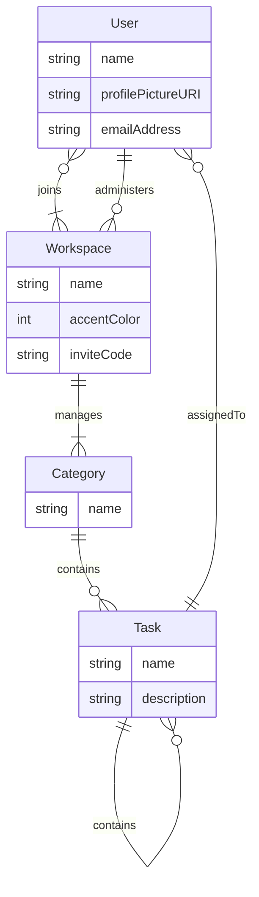

# Freeflow Firebase Firestore Setup

## ER Model

## Database Setup
- Collection `users`
    - Document IDs based on User ID
    - Each document represents one user
    - Document Fields
        - emailAddress: Int
        - name: String
        - profilePictureURL: String
        - workspaces: Array\<String\> *(Workspace IDs)*
- Collection `workspaces`
    - Document IDs based on Workspace ID
    - Each document represents one workspace
    - Document Fields
        - accentColor: Int
        - inviteCode: String
        - name: String
        - admin: Array\<String\> *(User IDs)*
        - users: Array\<String\> *(User IDs)*
    - Collection `categories`
        - Document IDs based on category name
        - Each document represents a category
        - Document Fields
            - name: String
            - subtasks: Array<String> *(Task ID)*
    - Collection `tasks`
        - Document IDs based on task ID
        - Each document represents a category
        - Document Fields
            - title: String
            - description: String
