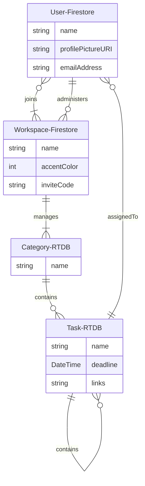

# Freeflow Firebase Setup

- Real-time Database (RTDB) 
  - Data is stored in Firebase Real-time Database, main advantage is that all users can listen to changes in the real-time database and update instantly.
- Cloud Firestore (Firestore)
  - Data is stored in Firebase Cloud Firestore, main advantage is that data is stored in the form of documents.

