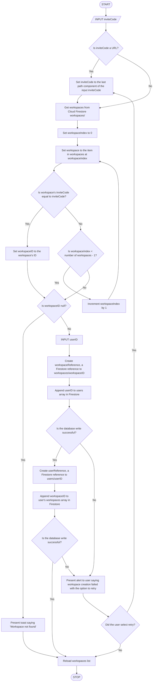

# Join Workspace
Requirements:
- If user inputs a URL as the inviteCode, strip the URL to get the _actual_ code
- Check that the inviteCode corresponds to a workspace in Cloud Firestore
- If successful, append the `workspaceID` to the users/`userID`'s workspaces property and append the `userID` to the workspaces/`workspaceID`'s users property in Cloud Firestore.

